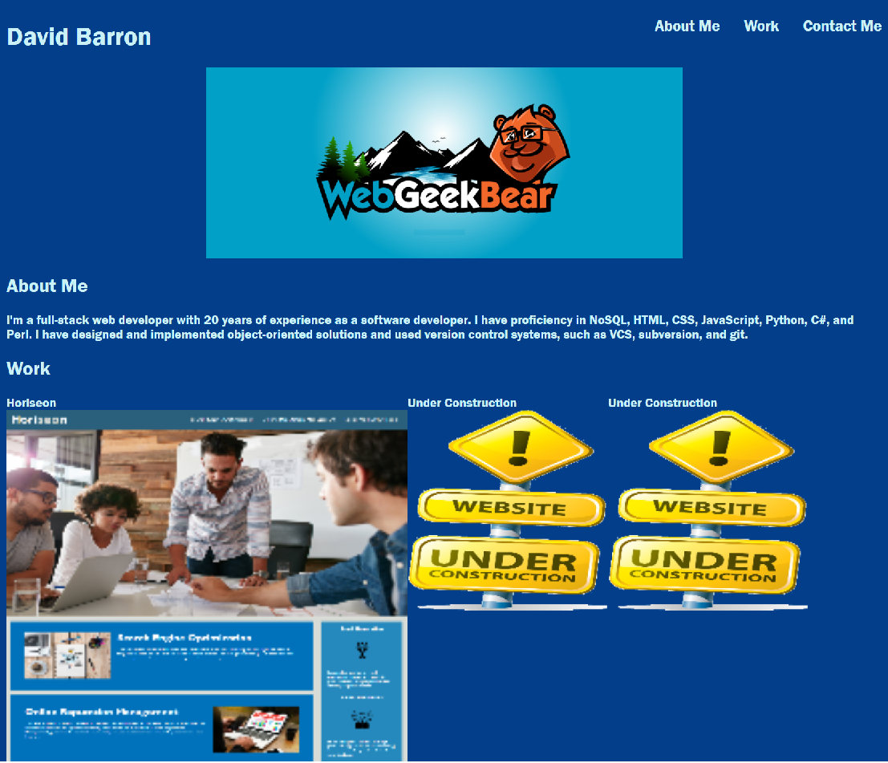

# David Barron's Portfolio

## About Me

I'm a full-stack web developer with 20 years of experience as a software developer. I have proficiency in NoSQL, HTML, CSS, JavaScript, Python, C#, Perl, object-oriented design and implementation, subversion, and git.

## Application deployment

This application is deployed at https://webgeekbear.github.io/portfolio/.

## Screenshot

